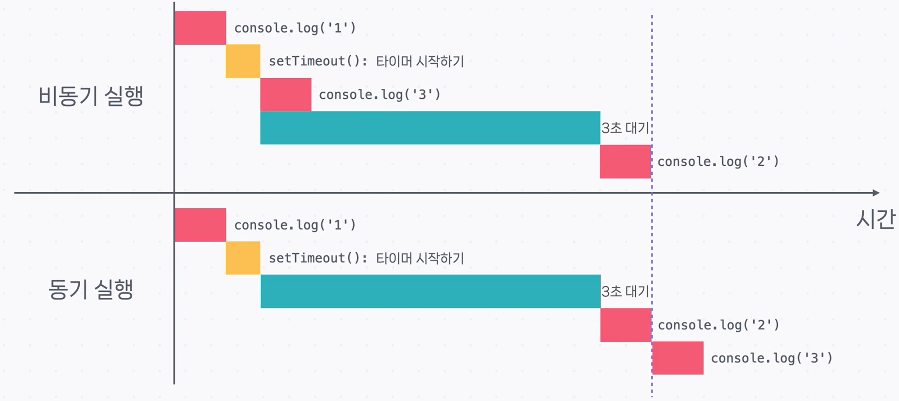

# 콜백과 비동기 함수

## 정의(한 줄 요약)

- **콜백(Callback)**: **함수의 인자로 다른 함수를 전달**하는 것. 전달된 함수가 **콜백 함수**다.
- **비동기 함수(Asynchronous Function)**: **중간에 대기나 외부 작업**이 있을 때 **다른 일부터 진행**했다가, **완료 시 다시 돌아와 마무리**하는 식으로 동작하는 함수.

---

## `setTimeout` — 시간 후 콜백 실행

```js
setTimeout(() => console.log('Hello World!'), 3000);
```

### 설명

- `setTimeout(콜백, 지연시간ms)` 형태입니다.
- **첫 번째 인자**로 **콜백 함수**(여기서는 화살표 함수)를 전달합니다.
- **두 번째 인자** `3000`은 **3초 뒤**에 콜백을 실행하라는 의미입니다.
- 실행하면 처음엔 출력이 없다가, **3초 후** `Hello World!`가 콘솔에 찍힙니다.
- **중요 포인트:** **콜백 자리에 어떤 함수든** 전달할 수 있습니다

---

## 순서가 바뀌는 출력 — 비동기 흐름 예시

```js
console.log('1');

setTimeout(() => console.log('2'), 3000);

console.log('3');
```

### 예상 결과

```terminal
1
3
2
```

### 라인별/블록별 해설

- `console.log('1');` → 즉시 `1` 출력.
- `setTimeout(() => console.log('2'), 3000);`

  - **3초 뒤 실행할 콜백**을 예약만 하고, **바로 다음 줄로 진행**합니다.

- `console.log('3');` → 이어서 즉시 `3` 출력.
- **3초 경과 후** 예약된 콜백이 실행되어 `2`가 출력됩니다.

> 요점: **작성 순서(1→2→3)** 와 달리, 실제 실행은 **1→3→(3초 후)2**가 됩니다.
> 기다리는 동안 **다음 작업을 먼저 처리**한다는 점이 비동기의 핵심입니다.

---

## 실행 흐름 비교(비동기 vs. “동기라고 가정했을 때”)

</img>

### 비동기 실행

1. `console.log('1')` 실행
2. `setTimeout()` 호출 → **타이머 시작만** 하고 다음 코드로 진행
3. `console.log('3')` 실행
4. **3초 대기**(타이머가 끝나기를 기다림)
5. `console.log('2')` 실행

### “동기”라고 가정했을 때

1. `console.log('1')` 실행
2. `setTimeout()` 호출 → 타이머 시작
3. **3초 대기(여기서 멈춤)**
4. `console.log('2')` 실행
5. `console.log('3')` 실행

### 비교 관찰(표현 보완)

- 이 예제에서는 **마지막 출력 시점 자체는 비슷**할 수 있습니다(둘 다 3초 안팎).
- 핵심은 **대기 시간 동안에도 다른 작업(`'3'` 출력 등)을 먼저 진행**할 수 있어 **전체 처리 효율이 좋아진다**는 점입니다.
- **대기 이후 작업이 크거나 많을수록** 비동기의 **효율 이점**이 커질 수 있습니다.

---

## 비동기 함수와 콜백의 관계

- **`setTimeout`은 비동기 함수**입니다. 콜백을 **나중에** 실행합니다.
- **비동기 함수**는 “함수 내용을 한 번에 끝까지 실행”하지 않고, **중간에 다른 작업을 처리**한 뒤 **다시 돌아와 마무리**합니다
- **콜백**을 쓰면 **나중에 해야 할 작업을 함수 형태로 전달**해 둘 수 있어서, **비동기 함수를 구현·활용**할 때 **특히 유용**합니다.
- 콜백이라는 이름도 **“Call Back(나중에 다시 부르다)”** 에서 온 것으로, **바깥 함수 안에서 언젠가 실행**되기 때문입니다.
- JavaScript 및 라이브러리는 **여러 비동기 함수**를 제공하며, **그 함수들에 콜백을 넘겨** 비동기 프로그램을 구성할 수 있습니다.

---

## 핵심 요약

- **콜백**: 함수의 **인자로 전달되는 함수**. **나중 실행**을 위해 넘깁니다.
- **`setTimeout(콜백, ms)`**: **ms 후 콜백을 실행**합니다. 예시에서는 **1→3→(3초 후)2** 순서로 출력됩니다.
- **비동기 함수**: **대기 중에도 다음 일을 먼저 진행**하고, **완료 시 돌아와 마무리**합니다.
- **효율성 포인트**: 단순 예제에선 총 소요 시간이 비슷할 수 있지만, **대기 구간을 놀리지 않음**으로써 **처리 효율**을 높입니다.
- **콜백은 비동기 활용의 핵심 도구**로, **나중에 실행할 작업을 전달**하는 데 쓰입니다.
