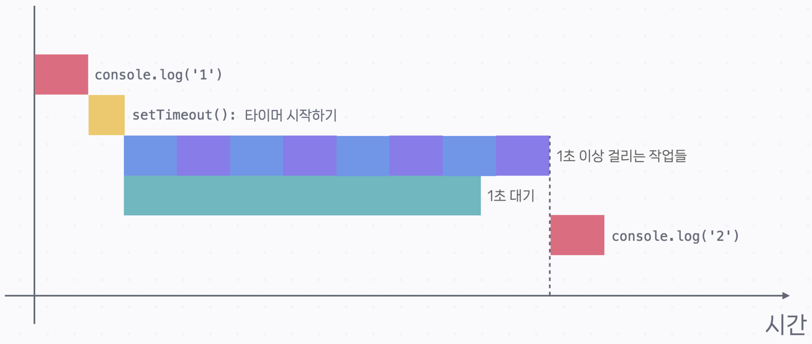
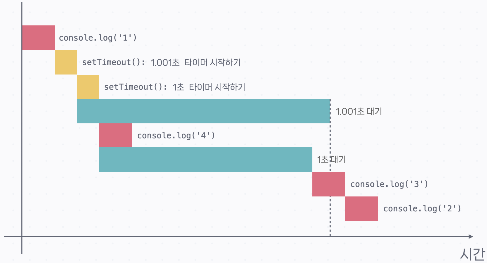

# 비동기 실행 파헤치기

**정의(한 줄 요약)**

- **비동기 함수**: **지금 당장 끝내지 않고** 필요한 시점에 **나중에 콜백을 실행**하도록 예약하는 함수.
- **콜백(callback)**: **나중에 실행하기 위해** 함수의 인자로 **전달되는 함수**.

---

## 1) 비동기 함수 뒤의 코드가 먼저 실행된다

```js
console.log('1');

setTimeout(() => console.log('2'), 0);

console.log('3');
console.log('4');
console.log('5');
console.log('6');
console.log('7');
console.log('8');
console.log('9');
console.log('10');
```

### 출력

```terminal
1
3
4
5
6
7
8
9
10
2
```

### 핵심 포인트

- `setTimeout(fn, 0)`은 **“가능한 한 빨리” 실행하도록 예약**한다는 뜻이지, **즉시 실행**이 아닙니다.
- 그래서 **비동기 함수 이후**에 있는 `console.log('3') ~ '10'`이 **먼저 실행**되고, 그 다음에 `2`가 출력됩니다.

### 흐름 설명

1. `console.log('1')` 실행
2. `setTimeout(..., 0)`으로 **콜백 실행을 예약**
3. 이어지는 `console.log('3'~'10')`을 **쭉 실행**
4. 예약된 콜백 `console.log('2')` **마지막에 실행**

아래처럼 “이후 코드가 오래 걸리는 경우”에도 **이후 코드가 다 끝난 뒤** 콜백이 실행됩니다.

```js
console.log('1');

setTimeout(() => console.log('2'), 1000);

// 1초 이상 걸리는 작업들
```



> 대부분의 실제 상황에서는 비동기 작업(예: 네트워크 대기)이 더 오래 걸리므로, **몇 ms 단위의 콜백 시점 차이**가 문제 되는 경우는 드뭅니다.

---

## 2) 실행할 콜백이 여러 개일 때는 순차적으로 실행된다

```js
console.log('1');

setTimeout(() => console.log('2'), 1001);
setTimeout(() => console.log('3'), 1000);

console.log('4');
```



### 핵심 포인트

- 두 타이머가 비슷한 시점에 끝나더라도, **콜백은 동시에 실행되지 않고 순차적으로(동기적으로) 실행**됩니다.
- 비동기 작업은 **각자 대기를 진행**할 수 있어 전체적으로 **효율**을 얻을 수 있지만, **콜백 실행 자체는 차례대로** 일어납니다.

---

## 핵심 요약

- `setTimeout(fn, 0)`은 **즉시 실행이 아니라** “가능한 한 빨리” 실행 **예약**입니다.
- **비동기 함수 뒤의 코드가 먼저** 실행되고, **나중에 콜백이 실행**됩니다.
- **여러 콜백**이 준비돼도 **동시에 실행되지 않고 순차 실행**됩니다.
- 실제로는 비동기 작업(대기)이 더 오래 걸리므로, **콜백 시점의 미세한 차이**는 보통 문제되지 않습니다.
